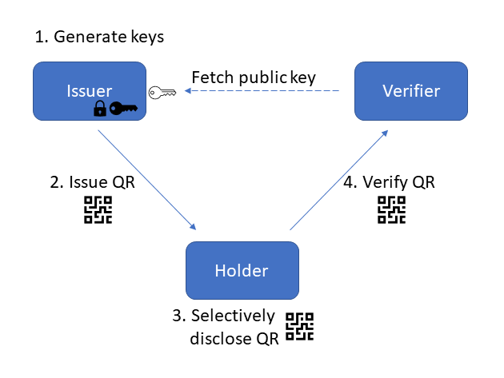
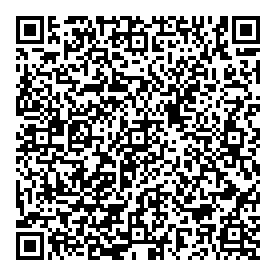

# Claim QR Codes

It is useful for users to be able to present attribute information, or _claims_ about themselves to various relying parties. This commonly happens in online exchanges, through federated protocols such as OpenID Connect. The situation is quite different in the real-world, where the claims are typically encoded in physical documents (e.g., drivers license, employment badges, etc.) in which various measures are employed to protect the integrity of the documents and to attest to their origin.

The advent of COVID vaccination credentials popularized the idea of carrying electronically-protected claims while presenting them in an offline manner, typically using a QR code. One such popular effort is the [SMART Health Cards](https://smarthealth.cards/) (SHC) framework that enabled millions of people to hold their proofs of vaccination in a QR image or a paper printout and present them to various verifiers.

This paradigm of showing electronically protected claims using a QR code is an interesting one. The ubiquity of smartphones allowing users to hold their claims in a client wallet, and verifiers to easily scan the QR codes for validation, makes it very easy to interact in a user-centric, _ad hoc_ manner.

The goal of this project is to prototype how generic claims (attributes) can be issued to users in the form of a QR code that can be presented to verifiers, who can dynamically discover the issuer and validate the claims. We call this credential a Claim QR (CQR). In this initial release, we are reusing most of the technical specification of the SHC framework to facilitate reusing existing implementations; alternative options and new features will be explored in [future versions](#extensions).

## System overview

**Claims** (a.k.a. attributes) are issued by an **issuer** to a **holder** (a.k.a. user) in the form of a QR code, which is later presented to a **verifier**. 

Each issuer participating in the system, identified by a URL `[ISSUER_URL]`, creates a signing key pair, and makes its public key available in a JSON Web Key (JWK) set hosted at `[ISSUER_URL]/.well-known/jwks.json`.

The claims are encoded into a [JSON Web Token](https://datatracker.ietf.org/doc/html/rfc7519) (JWT), which is in turn compressed, signed with the issuer private key, and encoded into a QR image.

Verifiers can extract the JWT from presented QR codes after validating the issuer signature: the issuer identifier is first extracted from the QR code, the corresponding public key is either retrieved from the online location or from a local cache. Deciding which issuers to trust is application-specific; some applications could have a pre-determined set of issuers, or a hierarchical approach (e.g., like in PKI) could be used.

The following diagram illustrates the system.



## Claim QR specification

This section contains the specification for Claim QRs.

### Issuer setup

This section specifies the steps to setup a CQR issuer. An issuer is specified by a HTTPS URL `[ISSUER_URL]` without a tailing '/' character.

#### Issuer key generation

An issuer must first create a JSON Web Key (JWK) (see [RFC 7517](https://datatracker.ietf.org/doc/html/rfc7517)) signing key pair, which SHALL be a Elliptic Curve key using the NIST P-256 curve (identified as algorithm `ES256` in JWS). The private key must be protected using conventional techniques (see, e.g., the JWS [security considerations](https://datatracker.ietf.org/doc/html/rfc7515#section-10)). The public JWK has the following requirements:

* SHALL have the properties "kty": "EC", "use": "sig", and "alg": "ES256"
* SHALL have "kid" equal to the base64url-encoded SHA-256 JWK Thumbprint of the key (see [RFC 7638](https://datatracker.ietf.org/doc/html/rfc7638))
* SHALL have "crv": "P-256, and "x", "y" equal to the base64url-encoded values for the public Elliptic Curve point coordinates (see RFC7518)
* SHALL NOT have the Elliptic Curve private key parameter "d"

#### Issuer key publication

Issuers SHALL publish their public keys in a JWK set (see [section 5 of RFC 7517](https://datatracker.ietf.org/doc/html/rfc7517#section-5)) available at `[ISSUER_URL]/.well-known/jwks.json`, with [Cross-Origin Resource Sharing](https://developer.mozilla.org/en-US/docs/Web/HTTP/Headers/Access-Control-Allow-Origin) (CORS) enabled, using TLS version 1.2 following the IETF [BCP 195](https://www.rfc-editor.org/info/bcp195) recommendations or TLS version 1.3 (with any configuration).

#### Issuer key rotation

Guidelines for key rotation is application-specific; a period of one year is RECOMMENDED by default. A new key pair is generated, and its public key is added to the published JWK set.  

Old private keys SHALL be destroyed, old public keys SHALL remain in the published JWK set until no more valid (unexpired) CQR remain in circulation (otherwise verifiers won't be able to validate them).

#### Issuer key revocation

If an issuer key is compromised, the issuer SHALL immediately remove the corresponding public key from the published JWK set. Verifiers will from now on  reject CQR issued using that key. 

### Claim QR content

The payload of a Claim QR is a [JSON Web Token](https://datatracker.ietf.org/doc/html/rfc7519) (JWT). The JWT has the following requirements:

* SHALL have an `iss` claim containing the issuer URL `[ISSUER_URL]`
* SHALL have a `cqv` claim containing the CQR specification version; currently this is `0.1`

Various application-specific claims can be encoded into the JWT, including the standard ones for validity period (the not-before start time `nbf` and the expiration time `exp`).

### Claim QR issuance

To issue a CQR, the issuer takes the input JWT, makes sure its issuer URL `[ISSUER_URL]` is specified as the `iss` claim, sets the token's metadata if any (`nbf`, `exp`), then the issuer
1. converts the payload into a minified JSON string (without spaces and newlines)
2. compresses the string using the payload with the DEFLATE (see [RFC 1951]((https://datatracker.ietf.org/doc/html/rfc1951))) algorithm before being signed (note, this should be "raw" DEFLATE compression, omitting any zlib or gz headers)
3. creates a compact [JSON Web Signature](https://datatracker.ietf.org/doc/html/rfc7515) (JWS) using the its private signing key, using the compressed payload and setting the JWS header properties
  * `alg: "ES256"`,
  * `zip: "DEF"`,
  * `kid` equal to the base64url-encoded (see [section 5 of RFC 4648](https://datatracker.ietf.org/doc/html/rfc4648#section-5)) SHA-256 JWK Thumbprint of the key (see [RFC 7638](https://datatracker.ietf.org/doc/html/rfc7638))
4. generates a Quick Response (QR) code of maximum version (size) 22, containing two segments:
  * a `byte` mode segment containing the string `cqr:/`
  * a `numeric` mode segment containing the compact JWS. Each character "c" of the JWS is converted into a sequence of two digits as by taking Ord(c)-45 and treating the result as a two-digit base ten number. For example, 'X' is encoded as 43, since Ord('X') is 88, and 88-45 is 43. 
5. create a QR code image from the generated QR code text.

The issuer makes the QR code image available to the holder.

### Claim QR holding

A CQR is a bearer token, meaning there is no private key associated with the credential. It can be printed and stored physically, or stored digitally. 

### Claim QR presentation

A CQR can be presented to any verifier by simply showing the QR code image (digitally or on paper). A verifier can validate the CQR by
1. parsing the QR code image into a QR code text, validating the `cqr:/` header, and decoding the numeric encoding into a JWS,
2. peaking into the JWS payload to extract the `iss` claim encoding the issuer URL `[ISSUER_URL]`,
3. downloading the JWK set from `[ISSUER_URL]/.well-known/jwks.json` (unless the verifier has a recent cached copy), and extracting the public JWK with `kid` matching the JWS's `kid` header,
4. verifying the JWS using the issuer public JWK, returning the payload if valid,
5. inflating the payload to recover the encoded JWT 

Verifiers should only accept CQR from issuers they trust. Trust establishment is application specific. An application could setup a trust directory, similar to the [VCI directory](https://github.com/the-commons-project/vci-directory/) for SHCs.

### Issuer revocation

If an issuer key is compromised, the issuer SHALL remove it from its published JWK set. All issued CQR will from then on become invalid.

### Claim QR revocation

There is no defined mechanism to revoke a CQR in this version. Application profiles can adopt various mechanisms to achieve this, including [the one defined in the SHC framework](https://spec.smarthealth.cards/#revocation).

## Differences with the SHC framework

SHCs are meant to encode medical data, using the [FHIR](https://www.hl7.org/fhir/) standard, as opposed to general claims as it is done in this project. The main differences with the SHC framework [specification](https://spec.smarthealth.cards/) are:

* **No VC**: for simplicity, the claims are encoded directly in a JWT, and not in a Verifiable Credential object. In the SHC framework, the VC property simply acts as a shell for the FHIR bundle, so removing it helps removing a dependency.
* **No QR chunking**: SHCs can be split across multiple QR codes. This feature hasn't seen much adoption in practice, so this project doesn't make use of it. Application-specific methods can instead be used to split a payload across multiple QR codes, if needed.
* **No X.509 extension**: issue keys can be tied to a X.509 certificate by using the `x5c` property of the JWK. This project doesn't make explicit use of these feature, although an application profile could make use of it. 
* **cqr header**: SHC QR codes have a `shc` header; this project instead use the header `cqr` (for Claim QR).
* **CQR expiration**: SHCs express medical facts that do not expire, therefore SHCs do not contain an expiration date. CQRs, on the other hand, can encode any type of entitlements, and therefore an expiration date (using the JWT `exp` claim) can be present for many use cases.
* **No stand-alone file**: CQR are only available in the form of a QR, there is no equivalent to a `.smart-health-card` file.

## Extensions

This initial release reuses as much of the SHC framework as possible, by design. Given the more general scope of CQR, however, some design decisions might be revisited for different use cases.

* **Supported signature algorithms**: the only allowed signature algorithm at the moment is ECDSA using the NIST P-256 curve and SHA-256 hash algorithm (the JWS `ES256` algorithm). This simplifies and insures interoperability of implementations, but does not provide cryptographic agility. 
* **Different compression and QR encoding**: 

## Glossary

* **Claim**: An attribute or statement 
* **CQR**: Claim QR, a JWT encoded into a QR code, as specified herein.
* **JWK**: JSON Web Key, see [RFC 7517](https://datatracker.ietf.org/doc/html/rfc7517)
* **JWKS**: JSON Web Key Set, a set of JWKs, see [section 5 of RFC 7517](https://datatracker.ietf.org/doc/html/rfc7517#section-5)
* **JWS**: JSON Web Signature, see [RFC 7515](https://datatracker.ietf.org/doc/html/rfc7515)
* **JWT**: JSON Web Tokens, see [RFC 7519](https://datatracker.ietf.org/doc/html/rfc7519)
* **SHC**: SMART Health Card, see https://smarthealth.cards/

## Example

This section provides a sample CQR issuance.

### Issuer setup

The issuer, identified as `https://example.org/cqr`, generates its key pair. It keeps its private key secret

```JSON
{
    "kty": "EC",
    "crv": "P-256",
    "x": "gXA--qt2vKqVtBIZHagdLNMOqdEqQ7ckLUYhDea_GRM",
    "y": "C8xyswYTfEEd9JVUqsBOnGSN-hX3C0uBIlHpV3mIf3g",
    "d": "EMrMf-cwOC2olJjfyoQI3JfqvYD_fyxGzyVfkSenfQI",
    "kid": "trmyrXpqXKBZNd11uOc5-8V1m3kJ-JTpMxlw_ZszBYU",
    "use": "sig",
    "alg": "ES256"
}
```

and publishes its JWK set at `https://example.org/cqr/.well-known/jwks.json`

```JSON
{
    "keys": [
        {
            "kty": "EC",
            "crv": "P-256",
            "x": "gXA--qt2vKqVtBIZHagdLNMOqdEqQ7ckLUYhDea_GRM",
            "y": "C8xyswYTfEEd9JVUqsBOnGSN-hX3C0uBIlHpV3mIf3g",
            "kid": "trmyrXpqXKBZNd11uOc5-8V1m3kJ-JTpMxlw_ZszBYU",
            "use": "sig",
            "alg": "ES256"
        }
    ]
}
```

### Claim QR issuance

1. Given the following JWT:

```JSON
{
    "iss": "https://example.org/cqr",
    "nbf": 1648226603.76,
    "cqv": "0.1",
    "given_name": "First",
    "middle_name": "Middle",
    "family_name": "Last",
    "https://example.org/custom": "value"
}
```

2. The issuer deflates the minified JWT string:

```
6DCD410E82301005D0BBCC9AB480A69A1EC0959EC15418B049A740A7341AE3DD9D90B07339EFFF9FF98067060BCF9C67B65AE3CBD11C504D69D4DD92A082F818C036E6786E5B63EA833A990ABAA5C8A6568DE4A32F18EFD1110A5D7CE22C48BEEF03EE7ADB2EE1C1910FEF9DAF6EEBFE7DBD729E483AC58515E1FB03
```


3. The issuer creates the compact JWS:

```
eyJhbGciOiJFUzI1NiIsInppcCI6IkRFRiIsImtpZCI6InRybXlyWHBxWEtCWk5kMTF1T2M1LThWMW0za0otSlRwTXhsd19ac3pCWVUifQ.bc1BDoIwEAXQu8yatICmmh7AlZ7BVBiwSadApzQa492dkLBzOe__n_mAZwYLz5xntlrjy9EcUE1p1N2SoIL4GMA25nhuW2PqgzqZCrqlyKZWjeSjLxjv0REKXXziLEi-7wPuetsu4cGRD--dr27r_n29cp5IOsWFFeH7Aw.PZX_aafUfmLFL8NDLGXjTToiGyfdqMxYf54FYoOUO-24P0zcerCXiDsMCWaIEOmkVkVcPDPylHQhTuiPjyLMwQ
```

4. The issuer creates the QR text:

```
cqr:/567629595326546034602925407728043360287028656767542228092862372537602870286471674522280928653776534363764227217542247122426208623239250439053204313959423242037752036671386337743943597055041252540667224241406057360153540421236628742420433672117652712822646459102063451021412160743852552067773652071205556231217734565050655064204574443177087565716369617612245440240467043305386628310726322005086559724205356858776845226968637630454261563861317561730337243043437760312460001074357256717072075426372300005569051069506505125467082834704225255627102074013545435052525740576431253111332331264361393966602676575568327544570807254466344034000507350377545669224360237032224252282434646241624154352335766327365939726035617631327436
```

5. The issuer creates the QR image:



# Library

## Setup

Make sure [node.js](https://nodejs.org/) and [npm](https://docs.npmjs.com/downloading-and-installing-node-js-and-npm) are installed on your system; the latest Long-Term Support (LTS) version is recommended for both.

1. Get the source, for example using `git`
```
git clone -b main https://github.com/microsoft/ClaimQR.git
cd ClaimQR
```

2. Build the `npm` package
```
npm install
npm run build
```

3. Optionally, run the unit tests

```
npm test
```

## Usage

This section describes the command-line usage of the library; see the `sample/src/server.ts` for an example to see how to use the API.

### Generate the issuer keys

The issuer, identified by its URL `[ISSUER_URL]`, first needs to create its key pair. The resulting JSON Web Key Set (JWKS) file must be hosted at `[ISSUER_URL]/.well-known/jwks.json`, while the private key must be kept secret.

Using the `npm` command-line:

```
npm run generate-issuer-keys -- --jwksPath jwks.json --privatePath privatekey.json
```

The public key will be added to the JWK set file specified by  `jwksPath` (will be created if it doesn't exist). 

### Issuer a Claim QR

The issuer can create a QR code from a JSON Web Token (JWT) containing an `iss` property with the value `[ISSUER_URL]` and a set of application-specific claims, using its private key.

Using the `npm` command-line:

```
npm run issue-qr -- --privatePath privatekey.json --jwtPath jwt.json --qrPath qr.png
```

The resulting QR code image `qr.png` can be used by the user.

### Verify a Claim QR

Any party can verify a presented QR code, and extract the encoded JWT. The issuer's public key will be retrieved from the `iss` property in the encoded JWT; optionally, a JWK set can be passed to the verifier for offline validation.

Using the `npm` command-line:

```
npm run verify-qr -- --qrPath qr.png --jwtPath outjwt.json [--jwksPath <jwksPath>]
```

## Sample

The `sample/` folder contains a sample issuer and verifier that can be used to issue and verify a Claim QR.

To setup and deploy the sample, perform the following steps:
```
cd sample
npm install
npm run build
npm run deploy
```

## Contributing

This project welcomes contributions and suggestions.  Most contributions require you to agree to a
Contributor License Agreement (CLA) declaring that you have the right to, and actually do, grant us
the rights to use your contribution. For details, visit https://cla.opensource.microsoft.com.

When you submit a pull request, a CLA bot will automatically determine whether you need to provide
a CLA and decorate the PR appropriately (e.g., status check, comment). Simply follow the instructions
provided by the bot. You will only need to do this once across all repos using our CLA.

This project has adopted the [Microsoft Open Source Code of Conduct](https://opensource.microsoft.com/codeofconduct/).
For more information see the [Code of Conduct FAQ](https://opensource.microsoft.com/codeofconduct/faq/) or
contact [opencode@microsoft.com](mailto:opencode@microsoft.com) with any additional questions or comments.

## Trademarks

This project may contain trademarks or logos for projects, products, or services. Authorized use of Microsoft 
trademarks or logos is subject to and must follow 
[Microsoft's Trademark & Brand Guidelines](https://www.microsoft.com/en-us/legal/intellectualproperty/trademarks/usage/general).
Use of Microsoft trademarks or logos in modified versions of this project must not cause confusion or imply Microsoft sponsorship.
Any use of third-party trademarks or logos are subject to those third-party's policies.
